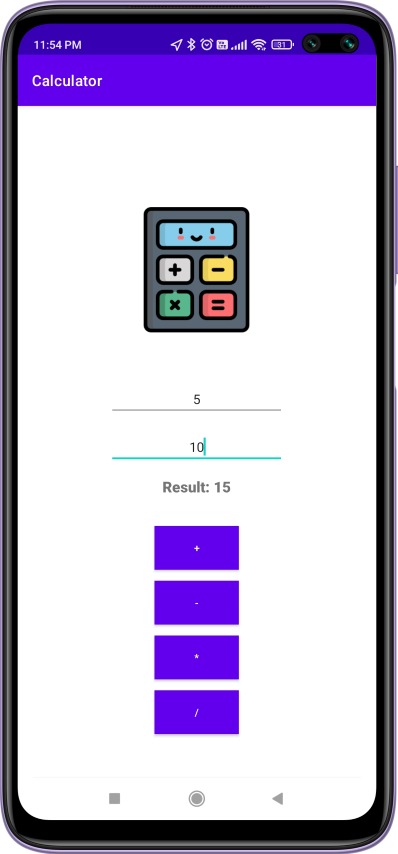

# ➗ Android Calculator

A simple android calculator based on Java and XML designed in Android Studio.

## ➕ Installation

Android Studio

## ➖ Usage

The Blueprint (XML):  This is like the blueprint for your house. The activity_main.xml file describes how your calculator app will look. It uses XML code to define elements like buttons (for numbers and operations), edit text fields (to enter numbers), and a text view (to display the result). You arrange these elements visually to create a user-friendly interface.

The Foundation (Java): This is the code that brings your app to life. The MainActivity.java file contains the Java code that controls how the app behaves. It does three main things:

Connects the blueprint to the house: It finds the buttons, edit text fields, and text view defined in the XML file and assigns them to variables in the code.
Listens for actions: It sets up listeners for the buttons. When a button is clicked, the listener triggers a specific action in the code.

Performs calculations: When an operation button is clicked, the code retrieves the numbers from the edit text fields, performs the chosen operation (addition, subtraction, etc.), and displays the result in the text view. It might involve converting text input to numbers and vice versa.

## ✖️ Screenshot

